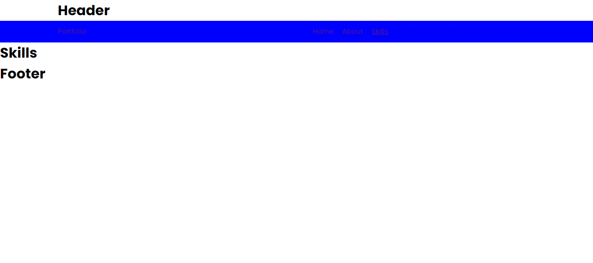

# My Portfolio Website

This is a React-based portfolio website that showcases my skills, experience, portfolio, and blog posts. The website is built using React Router for navigation and styled-components for styling.

## Table of Contents

- [Live Demo](#live-demo)
- [Installation](#installation)
- [Usage](#usage)
- [Project Structure](#project-structure)
- [Components](#components)
- [Pages](#pages)
- [License](#license)

## Live Demo

You can view the live demo of the project [here](https://shashikant.vercel.app/).

## Screenshot



## Installation

To get started with the project, follow these steps:

1. Clone the repository:

   ```bash
   git clone https://github.com/yourusername/portfolio-website.git
   cd portfolio-website

   ```

2. Install the dependencies:

```bash
npm install
```

3. Usage

```bash
nom run dev
```

## Project Structure

```bash
portfolio-website/
├── public/
│   ├── index.html
│   └── ...
├── src/
│   ├── components/
│   │   └── Layout.js
│   ├── pages/
│   │   ├── About.js
│   │   ├── Blogs.js
│   │   ├── Contact.js
│   │   ├── Error.js
│   │   ├── Experience.js
│   │   ├── Home.js
│   │   ├── Portfolio.js
│   │   └── Skills.js
│   ├── App.js
│   ├── index.js
│   └── ...
├── .gitignore
├── package.json
├── README.md
└── ...
```

## License

This project is licensed under the MIT License. See the LICENSE file for details.
